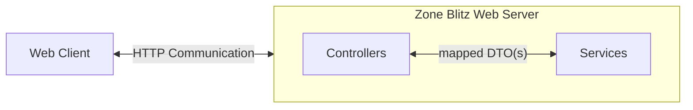

# Application

## Architecture

## Web Server

#### HTTP Flow



## Monolith

In alignment with the [philosophy](./architecture.md#philosophy), Zone Blitz is starting off as a monolith rather than microservices. This
is entirely just because it's easier to have all the code within one repository and keeping the overhead costs
very cheap.

Of course, we have the usual drawbacks of a monolith (scaling concerns, too much responsibility, etc...) which is worth noting.

## Technology Stack

- [Java via OpenJDK](https://openjdk.org/)
- [HTMX](https://htmx.org/)
- [UnoCSS](https://unocss.dev/)

### Libraries and Frameworks

- [Javalin](https://javalin.io/): HTTP Web framework used for serving HTTP routes and infrastructure.
- [jstachio](https://github.com/jstachio/jstachio): HTML Template Engine.

## Data Science

### Technology Stack

- [R](https://www.r-project.org/about.html)

### Libraries and Frameworks

- [nflfastR](https://www.nflfastr.com/)

## Why did you use this?

### Java

Java in a 2024+ world is actually very cool! In previous iterations and proof of concepts of Zone Blitz, I used
technologies like Node, Deno, and Rust.

I started off with Node and Deno, I ran into performance issues (darn memory leaks!) and limitations of having
a JavaScript runtime (even with using TypeScript). The developer experience was great though, and JavaScript
is my strongest and usually preferred language.

Next, I went to Rust in a strong shift to favoring performance. Unfortunately, Rust never clicked for me as a
developer friendly experience. Especially given that Zone Blitz is still in its infancy, I wanted to find a balance
with the developer experience of Node/Deno, _but_ some way to handle performance.

I looked into Go, Kotlin, and Java, and ultimately decided to actually go with Java. The main reasons being:

- Strong and mature library ecosystem, the Maven repository has a library for nearly everything!
- Nice balance for performance. Yeah, it's not going to be as performant as Rust or Go but it's miles ahead of the Node / Deno runtime.
- I'm a huge fan of the Java improvements that have come in recent releases that make it a more modern language.
  - i.e. `var`, pattern switch matching, much better lambda support.
- I've used Java before, and would not require needing to learn a new language from scratch making me more productive.

In fact, if you look at this snippet from `App.java` at the time of writing this article and you squint really hard, it looks
a _lot_ like your traditional Express server in Node:

```java
public static void main(String[] args) {
  Javalin
    .get(
      "/",
      ctx -> {
        var hello = new Hello();
        var output = new StringBuilder();
        JStachio.render(hello, output);
        ctx.html(output.toString());
      }
    )
    .start(8000);
}

```
