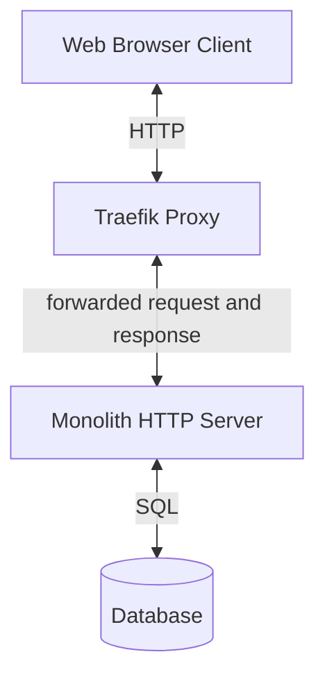

# Architecture

## High Level Cloud Diagram

## Philosophy

Overall, the philosophy of Zone Blitz pre-alpha is to build a simple, cheap, and developer
friendly experience in order to release quickly and cheaply, with the trade off of potentially
having future scale and performance issues if heavy traffic occurs. **If Zone Blitz is having
scale issues, this is a very good problem to have, it means the product is a hit 😄**. We can always
vertically scale while detailing a strategy to horizontally scale.

## Additional Documentation

If you're more curious, check out these doc pages below for more thesis like details about Zone Blitz's architecture!

- [Application](./application.md)
- [Operations](./operations.md)
