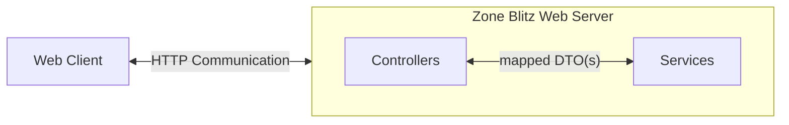

# Application

## Architecture

## Technology Stack

- [Java via OpenJDK](https://openjdk.org/)
- [Javalin](https://javalin.io/): HTTP Web framework used for serving HTTP routes and infrastructure.
- [jstachio](https://github.com/jstachio/jstachio): HTML Template Engine.
- [HTMX](https://htmx.org/)
- [UnoCSS](https://unocss.dev/)

## Web Server

#### HTTP Flow



### Philosophy

### High Level Mantras

- Embrace and leverage browser provided libraries and tooling. Modern browser capabilities are awesome and users don't need to download any additional code!
- Ensure everyone has access to using Zone Blitz. Whether they need to use a screen reader, do not want to use JavaScript, or are using an iPhone 1 with Safari to run their league.
- We can scale the server, we cannot scale the client.

#### Server Side Rendering and Minimal Client Work

I'm currently a fan of leveraging and expanding upon "old school" web values even for modern applications, like:

- Leveraging server side rendering and templating for render logic of HTML.
- Avoiding memory and resource intensive web client SPA frameworks and libraries unless necessary.
- Having an accessible, semantic, and parsable DOM structure.
- [Embracing the hypermedia nature of HTTP, HTML, and other web protocols.](https://htmx.org/essays/hateoas/)
- Progressive enhancement, allow your audience to not even have to use JavaScript if they do not desire to.

Zone Blitz follows this principle as well. I deliberately chose [htmx](https://htmx.org/) as the library for ensuring
the web client is simple, small, and lightweight.

While it is additional engineering work to build a truly server side applicaiton with progressive enhancements on the client,
I am a fan of the challenges this approach brings _and_ feel that it will greatly improve the user experience of Zone Blitz.

In fact, you could argue that there are performance benefits with this philosophy too. We can easily scale up our servers, we
_cannot_ scale client device capabilities.

#### Monolith, oh boy...

In alignment with the [overall philosophy](./architecture.md#philosophy), Zone Blitz is starting off as a monolith rather than microservices. This
is entirely just because it's easier to have all the code within one repository and keeping the overhead costs
very cheap.

Of course, we have the usual drawbacks of a monolith (scaling concerns, too much responsibility, etc...) which is worth noting.

### Why did you use this?

### Java

Java in a 2024+ world is actually very cool! In previous iterations and proof of concepts of Zone Blitz, I used
technologies like Node, Deno, and Rust.

I started off with Node and Deno, I ran into performance issues (darn memory leaks!) and limitations of having
a JavaScript runtime (even with using TypeScript). The developer experience was great though, and JavaScript
is my strongest and usually preferred language.

Next, I went to Rust in a strong shift to favoring performance. Unfortunately, Rust never clicked for me as a
developer friendly experience. Especially given that Zone Blitz is still in its infancy, I wanted to find a balance
with the developer experience of Node/Deno, _but_ some way to handle performance.

I looked into Go, Kotlin, and Java, and ultimately decided to actually go with Java. The main reasons being:

- Strong and mature library ecosystem, the Maven repository has a library for nearly everything!
- Nice balance for performance. Yeah, it's not going to be as performant as Rust or Go but it's miles ahead of the Node / Deno runtime.
- I'm a huge fan of the Java improvements that have come in recent releases that make it a more modern language.
  - i.e. `var`, pattern switch matching, much better lambda support.
- I've used Java before, and would not require needing to learn a new language from scratch making me more productive.

In fact, if you look at this snippet from `App.java` at the time of writing this article and you squint really hard, it looks
a _lot_ like your traditional Express server in Node:

```java
public static void main(String[] args) {
  Javalin
    .get(
      "/",
      ctx -> {
        var hello = new Hello();
        var output = new StringBuilder();
        JStachio.render(hello, output);
        ctx.html(output.toString());
      }
    )
    .start(8000);
}

```

### Javalin

I literally just wanted to learn and use something _other_ than Java Spring REST / Web libraries for once!

That being said: I really like Javalin because it reminds me of the things I _love_ about Express / Koa based node middleware servers I've worked in.

### htmx

In alignment with [my application philosophy](#philosophy), htmx is a fantastic library for achieving a minimal, lightweight client.

### UnoCSS

UnoCSS is just a different flavor of a [Tailwind](https://tailwindcss.com/) atomic utility styling library. I could have also used Tailwind and still have been happy.

I like atomic utility styles because they are a _perfect_ fit for a server side rendered application like Zone Blitz. I don't have to worry about serving different stylesheets
and managing them within the server's assets folder. I can just serve a minified styles CSS file that will work for all pages and not be a huge memory size concern. In the future,
I could even generate and cache the CSS on the fly on page requests to only include the styles used on the page. I will save this optimization until we _truly_ need it 😁 .

## Data Science

### Technology Stack

- [R](https://www.r-project.org/about.html)

### Libraries and Frameworks

- [nflfastR](https://www.nflfastr.com/)
