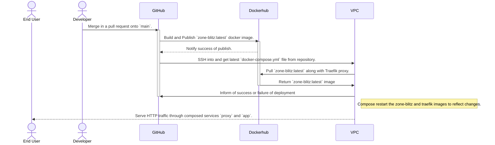

# Operations

## Technology Stack

- [Docker](https://www.docker.com/)
- [Dockerhub](https://hub.docker.com/)
  - Stores built Docker images for Zone Blitz application.
- [DigitalOcean](https://www.digitalocean.com/)
  - VPC provider being used currently.
- [Github](https://github.com/)
- [Github Actions](https://github.com/features/actions)
  - CI/CD platform of choice.
- [Traefik](https://github.com/traefik/traefik)
  - Web cloud proxy for SSL termination and future proxy goodies.

## Deployments

Deployments happen in a continuous fashion on pushes to the `main` branch. `main` is a protected branch that can only be updated by merging in passing pull requests.

### Diagram

Below is a visual sequence diagram of the steps taken on the automated deployment job.

## Strategy

The strategy is very wild, wild west right now 😅. Essentially, I'm using docker compose to run a cloud published image of zone blitz and its web proxy Traefik.

On new changes, we publish a new Dockerhub image and then tell the DigitalOcean VPC to grab the latest and run
that.

Traefik is awesome because it automatically sets up an HTTPS SSL certification for us, along with being a safe
proxy layer to avoid exposing the java server directly on an HTTP or HTTPS port. It's only being used for SSL
termination currently because there's only one monolith service, but it has the potential to scale nicely as Zone Blitz grows and more concerns arise.
